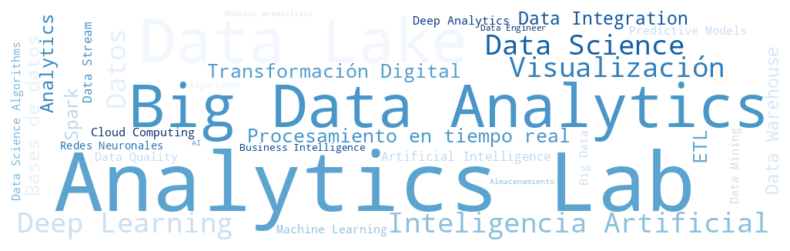

# Analytics-Lab

### ¿Qué es Analytics-Lab?

Analytics Lab es un repositorio diseñado como un entorno de experimentación y desarrollo para proyectos de análisis de datos aplicados a la toma de decisiones empresariales. Reúne el trabajo con múltiples datasets públicos y privados, integrando herramientas como Python para ciencia de datos, Power BI y Looker Studio para visualización y reporting. El objetivo es explorar procesos de limpieza, transformación y modelado de datos, así como generar visualizaciones interactivas que faciliten el entendimiento de métricas clave, patrones de comportamiento y oportunidades de optimización dentro de distintos contextos de negocio.

### Acerca de mi

Coordinador de Mantenimiento orientado a la administración de operaciones mediante el Data Science. Tecnólogo Automotriz con 10 años de experiencia en el sector diseñando estrategias y mantenimiento de vehículos automotrices, rutas por carretera, aprovechamiento de datos, control interno, monitoreo, control de combustible, lubricantes, llantas y repuestos. Desempeñando cargos como Coordinador de Transportes, Líder Técnico, Analista de flotas y Técnico Mecánico Automotriz.

He conseguido aumentar rendimientos y logrado reducir costos de operación en las flotas que he laborado, dependiendo del proyecto a intervenir gracias al análisis de datos con herramientas como Power BI usando lenguaje DAX y SQL. También el uso de Google Data Studio y Python (tanto en el IDLE local como en Jupyter, Google Colab, IBM Cloud y Visual Studio Code). Mediante el análisis con estas herramientas me enfoco a las tomas de decisiones para orientar a la compañía al mejor resultado posible, todo esto se refuerza con la experiencia operativa que obtuve siendo técnico automotriz. Esto me ha llevado a ser responsable de distintas capacitaciones sobre el cuidado de llantas en algunas empresas importantes del sector y así como formador técnico de algunos equipos de trabajo el cual permite mejoras en la planificación, intervención y operatividad de vehículos automotrices.

### Estado del Proyecto

Este proyecto se encuentra actualmente en desarrollo por lo tanto algunas caracteristicas pueden no funcionar correctamente

